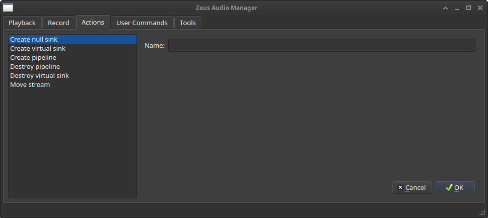
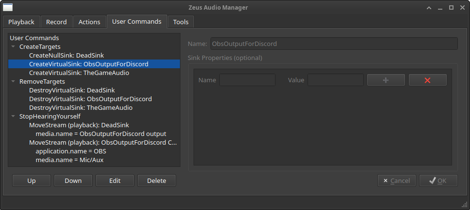

zeus
====





### Overview

zeus - **Z**eus **E**nhanced a**U**dio tool**S**. Zeus provides a small set of
tools for managing a PipeWire graph. These tools, which it calls actions, can be
run by themselves, or as part of a user-defined command.

The commands above are a simplified portion of what I use Zeus for.

### Requirements

To use Zeus, you'll need the PipeWire Pulse server. You can check if you have
it installed by running `pactl info` and checking if the `Server Name` field
mentions PipeWire.

Ubuntu users:

```
sudo apt install libpulse-dev libpulse-mainloop-glib libqt6widgets6 pipewire-pulse 
```

### Actions

**Create null sink**: A null sink is a virtual sink, except that audio is
discarded instead of routed elsewhere.

**Create virtual sink**: A virtual sink is a playback device that doesn't have
a hardware device associated with it. Virtual sinks play back their audio on the
**default audio device**. However, the stream can be rerouted. If a stream with
the same name exists, nothing is done.

**Create pipeline**: A pipeline copies audio from a source and plays it on the
destination. If Zeus thinks you've already made a pipeline for the given source
and destination, nothing is done.

**Destroy pipeline**: This destroys pipelines created by Zeus.

**Destroy virtual sink**: This destroys virtual sinks. It can also destroy null
sinks, which are a kind of virtual sink.

**Move stream**: Moving a stream changes the device that it targets, based on
criteria given.

### Command-line

If Zeus is executed with arguments, it will process those arguments and exit
instead of showing the main window.

```
Usage: zeus [options]
Zeus Enhanced Audio Tools: Tools for managing a PipeWire graph.

Options:
  -h, --help               Displays help on commandline options.
  --help-all               Displays help, including generic Qt options.
  -c, --command <command>  Execute <command>.
  -l, --list               Show available commands.
```

### Why can't I move this stream?

When applications create audio in PulseAudio, they have access to a variety of
flags to set on streams. One of them, `PA_STREAM_DONT_MOVE`, prevents the stream
from being moved to a different device. At the same time, PulseAudio doesn't
appear to provide an api to indicate that a stream is pinned.

### Why

I stream on Twitch and someone wanted to do co-commentary with me for a
particular game (Star Ocean 4). I needed to send them my audio (game and obs
output), and get their commentary back to mix into OBS. I figured this would be
an easy process.

Getting the audio to work was so miserable that I decided to make this tool to
both make it easier **and** to automate it.
